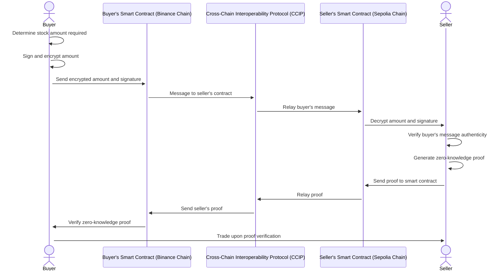

# Chainlink Hackathon Project



## Usage

### Build Circuits

Make sure [Circom](https://docs.circom.io/getting-started/installation) is installed.

```bash
cd circuits
npm install
./build.sh
```

### Run Frontend

First make a file called `.env.local` in the `frontend` directory with the following contents (replacing `<YOUR WALLETCONNECT PROJECT ID>` with your WalletConnect project ID):

```
NEXT_PUBLIC_WALLETCONNECT_PROJECT_ID="<YOUR WALLETCONNECT PROJECT ID>"
```

Then you can run the frontend:

```bash
cd frontend
npm install
npm run dev
```

## Development

### Run Tests

```bash
cd circuits
npm run test
```
